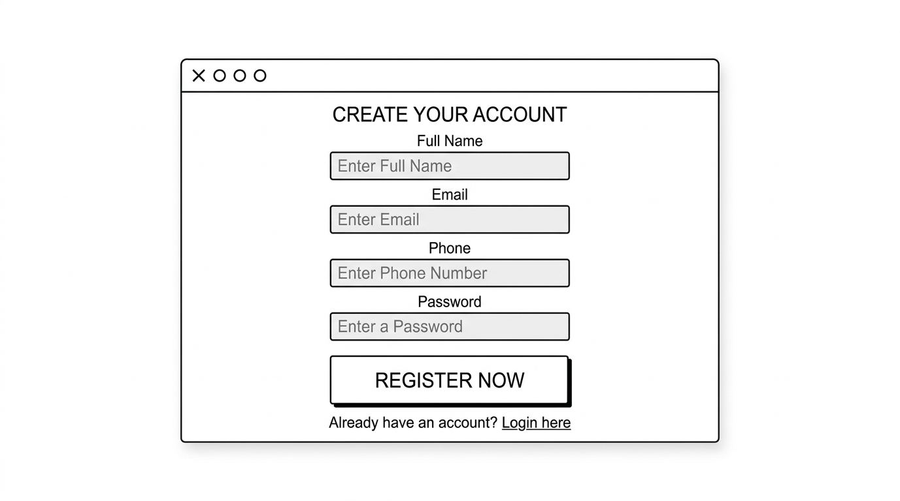

# Register Page Wireframe

## Main Sections
- Registration form
- Footer placeholder

## UI Elements
- Name field
- Email field
- Phone number field
- Submit button
- Validation hints / error message area

## Notes
- The form is used for event registration
- Error messages should appear clearly if fields are missing or invalid
# 🖼️ Wireframe – Register Page

## #Wireframe

**Description:**  
This wireframe represents the registration page where users can create a new account.
